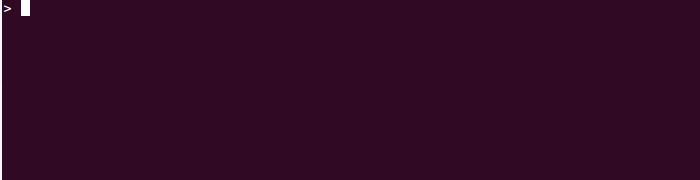

sass-test.sh
======

A script for testing Sass libraries by comparing compiled output. 
It supports both `Ruby sass` and `Libsass` implementations according of what is installed.




Installation
------

Install it via npm:

```sh
npm install sass-test.sh --save
```

You can set your `package.json` to use sass-test.sh.
If your use cases are not in the `test/` folder, set the path as script argument:

```json
{
  "scripts": {
    "test": "sass-test [test directory|scss test files]"
  }
}
```

Lanch your tests

```sh
npm test
```


Usage
------

In the default usage, the script searches for test cases into the `test/` folder.
You can set up another folder or directly a specific test case.

```sh
sass-test folder/
sass-test folder/testcase.scss
sass-test folder/testcase1.scss folder/testcase2.scss
```

The default script mode only show test status.
You can automatically regenerate test results, with the `regenerate` mode:

```sh
sass-test --regenerate folder/
```

You can also use the `interactive` mode.
In error cases, it will ask you if you want to see the differences or to regenerate the test result:

```sh
sass-test --interactive folder/
```


Projects using it
------

 * [](https://travis-ci.org/tzi/herow.scss)
   [herow.scss](https://github.com/tzi/herow.scss):
   A time-saving Sass grid system.
 * [](https://travis-ci.org/tzi/chewing-grid.css)
   [chewing-grid.css](https://github.com/tzi/chewing-grid.css):
   A CSS Grid ideal for card listing design like tiles, videos or articles listing
 
Are you using sass-test.sh? [Let me know](https://twitter.com/iamtzi) about it or add it directly with a PR. 
 
 
Other Sass testing lib
------

Not satisfied with sass-test.sh? Maybe you should try theses awesome projects:

 * [SassUnit](https://github.com/penman/SassUnit): A Ruby gem for comparing compiled output.
 * [SassyTester](https://github.com/HugoGiraudel/SassyTester): A minimalistic function tester in Sass.
 * [True](https://ericam.github.com/true): Unit tests for Sass.
  
  
How to Contribute
--------

1. [Star](https://github.com/tzi/sass-test.sh/stargazers) the project!
2. [Report a bug](https://github.com/tzi/sass-test.sh/issues/new) that you have found.
3. Tweet or blog about sass-test.sh and [Let me know](https://twitter.com/iamtzi) about it.
4. [Pull requests](CONTRIBUTING.md) are also highly appreciated.


Author & Community
--------

sass-test.sh is under [MIT License](http://tzi.mit-license.org/).<br>
It was created & is maintained by [Thomas ZILLIOX](http://tzi.fr).
